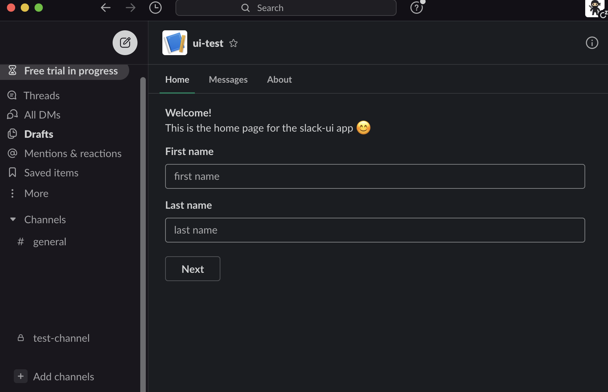
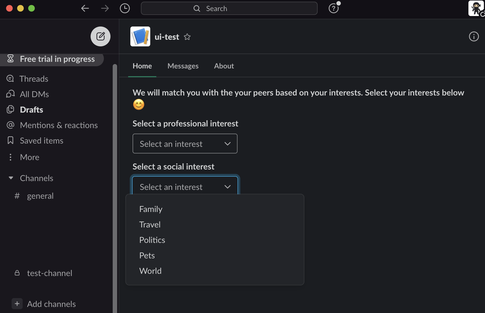
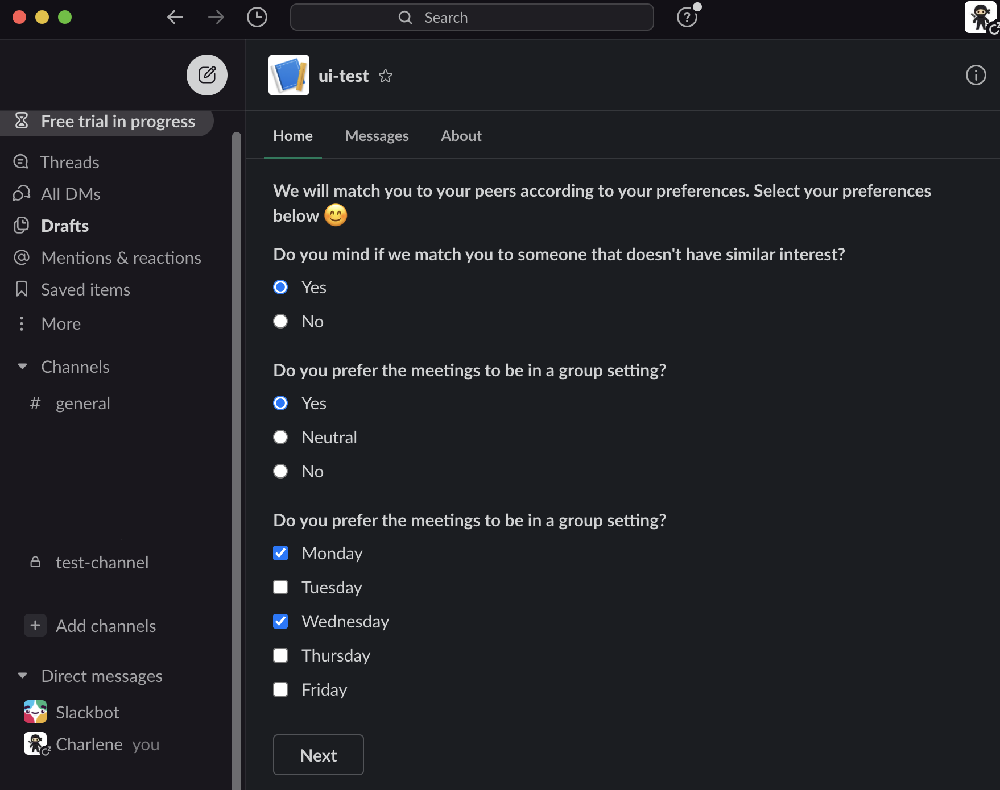
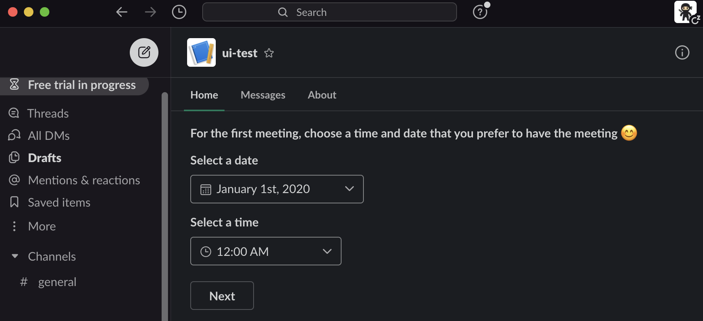
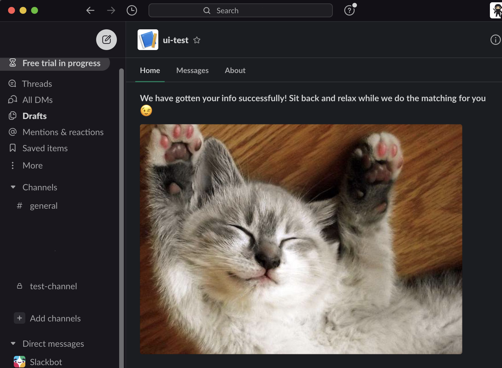
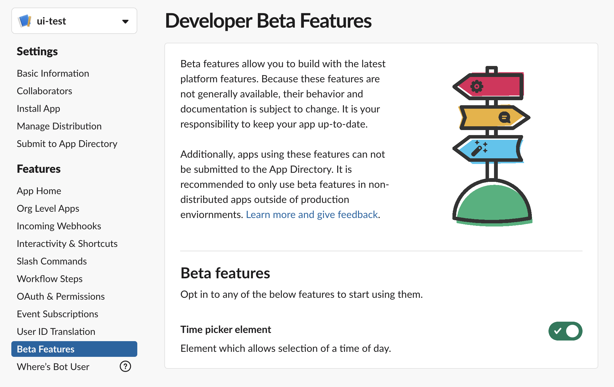
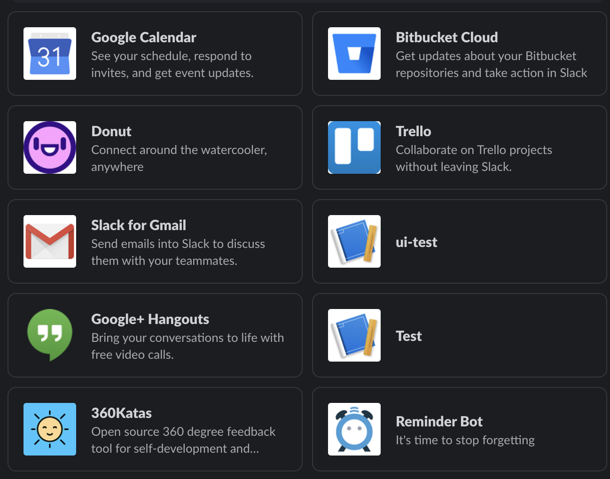

# Slack UI Exploration App

This purpose of this project is to explore the various user interface components that is currently available on slack.

## Installation

```
npm install
```
## Screenshots







## Setup

### Creating a new Slack app
1. Create a new slack app at https://api.slack.com/apps 
2. Go to the OAuth & Permissions tab under the application dashboard page (Features) and add `chat:write` under the Scopes section. 
3. Reinstall/Install your app on your workspace for the changes to take place. 


### Running the app
1. Make sure `npm install` is done before running.
2. Make a copy of `.env.staging` and rename it as `.env`. Fill the respective credentials.
	* SLACK_SIGNING_SECRET: Your application's signing secret key that can be found under the **Basic Information** tab in your application dashboard.

	* SLACK_ACCESS_TOKEN: Your application's OAuth Access Token that can be found under the **OAuth & Permissions** tab in your application dashboard. 

3. Run the app (`nodemon server`)
4. Start ngrok on the same port as your server. 

### Setting up event subscriptions
1. Navigate to the App Home tab, ensure that **Home Tab** is checked. 
2. Thereafter, navigate to the **Event Subscription** tab. Make sure to enable events and enter your request url. Your request url will be `{your ngrok url}/events`. 
3. Next, scroll down to **Subscribe to bot events** and add the `app_home_opened` event.
4. After it's all done, click on Save. 

### Setting up Interactivity & Actions
1. Go to the **Interactivity & Shortcuts** tab; likewise, ensure that Interactivity is enabled and replace the request url. Your request url will be `{your ngrok url}/actions`.

### Enabling Developer Beta Features
The timepicker used in this repo is a beta feature (as of the date that this readme is created: 17/12/2020). 
Do enable the beta features by going to the **application dashboard -> beta features**


### Launching your app from slack
1. Go to your Slack workspace and under the **Apps** section in the sidebar menu, click on **Add apps**. You should see a list of installed app and the name of your app should be visible. 




